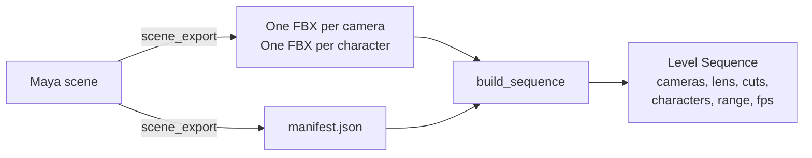

# vista

A Maya to Unreal cinematic shot pipeline.

An artist animates cameras and characters in Maya. One click exports them. One click in
Unreal builds the Level Sequence: the cine cameras with the correct lens and filmback, the
Camera Cut Track, the skeletal animation, the playback range and the frame rate.

Name and usecase inspired by Guild Wars 2 vistas: the camera leaves the player, moves across the
scenery, and returns.

---

## Why

Unreal's FBX import can put a camera's animation onto a camera that already sits in a Level
Sequence. It cannot build the structure around it. For every shot, somebody creates the
CineCameraActor, binds it, imports onto the binding, and places the camera cuts, by hand.

The lens needs care too. The Sequencer FBX import writes the FBX film back and focal length
onto the camera's spawnable template, not onto the camera in the viewport. It also writes
Maya's default focus distance of 5 cm. So right after an import, the viewport shows Unreal's
default sensor, which is 16.9 degrees too narrow for a 36 x 24 mm Maya camera, and a
respawned camera is out of focus.

vista builds the structure, and it sets the lens from its own manifest after the import, on
the live camera and on the template. The result does not depend on importer details.

---

## How it works



- **FBX** carries the animation: camera transforms, focal length, skeletons, meshes.
- **The manifest** carries the structure: the scene range and frame rate, the shot list, the
  lens values in millimetres, the character list.
- **`core`** reads and writes the manifest, decides the cut list, and runs the validation
  rules. It imports neither `maya` nor `unreal`, so it runs and tests in plain Python.

```
vista/
  core/            manifest format, cut list, validation rules    (plain Python)
  maya_tools/      scene export, FBX settings, dockable window    (Maya)
  unreal_tools/    sequence builder, Editor Utility Widget calls  (Unreal)
  examples/        demo scene builder, headless batch export
  tests/           pytest tests for core
```

---

## Features

- **Multiple shots.** Every keyed camera becomes a shot. Each shot gets its own
  spawnable CineCamera and a cut on the Camera Cut Track.
- **Camera cut placement.** A cut starts where its camera's keys start and holds until
  the next shot starts. The first cut starts at the scene start, the last holds to the scene
  end. No frame is left without a camera.
- **Lens and filmback.** Focal length, sensor size (converted from Maya's inches),
  and the depth of field switch. Values are rounded, so a 36 x 24 mm Maya camera matches
  Unreal's `Full Frame DSLR` preset.
- **Skeletal animation.** Every skinned character in the scene exports with its baked animation and
  lands in the sequence on a Skeletal Animation Track.
- **Frame rate and playback range.** The sequence gets Maya's frame rate, including NTSC rates such as
  23.976 (stored as 24000/1001), and Maya's playback range, last frame included.
- **Validation.** Rules check the manifest before any file is written. Errors
  stop the export with warnings explaining why.
- **Rebuild.** A second build clears and reuses the same sequence, so a level that plays
  it keeps its link.
- **Restored editor state.** The Maya selection is restored after export. The Unreal
  Interchange FBX setting is restored after the build.
- **Maya window.** Dockable, PySide6, with a PySide2 fallback.
- **Batch export.** Headless with `mayapy`, with exit codes for a build machine.

---

## Requirements

| Tool | Version | Notes |
|---|---|---|
| Maya | 2026 | Tested. Older versions with PySide2 should work through the fallback, untested |
| Unreal Engine | 5.5 | Tested. Plugins: Python Editor Script Plugin, Editor Scripting Utilities |
| Python | 3.11 | Only for running the tests outside Maya and Unreal |

---

## Install

Clone the repository anywhere. The examples use `C:/tools/vista`.

**Maya.** Add the repository to Maya's Python path. Create or edit
`Documents/maya/2026/scripts/userSetup.py`:

```python
import sys
VISTA_ROOT = "C:/tools/vista"
if VISTA_ROOT not in sys.path:
    sys.path.append(VISTA_ROOT)
```

Restart Maya.

**Unreal.** Open Edit > Project Settings > Plugins > Python > Additional Paths, and add the
repository folder. Restart the editor.

**Tests (optional).**

```
py -3.11 -m pip install -r requirements.txt
py -3.11 -m pytest
```

---

## Use

### 1. Export from Maya

Open the window:

```python
from maya_tools import ui
ui.show()
```

Tick the cameras and characters, pick an output folder, and press **Check**, then **Export**.
The folder receives one FBX per camera, one per character, and `manifest.json`.

Without the window:

```python
from maya_tools import scene_export
manifest_path, issues = scene_export.export_scene("C:/vista_out")
```

Headless, from a command prompt:

```
mayapy examples/batch_export.py C:/vista_out path/to/scene.ma
```

### 2. Build in Unreal

In the Output Log, with the dropdown set to `Python`:

```python
from unreal_tools import build_sequence; build_sequence.build_from_manifest(r"C:/vista_out/manifest.json")
```

The sequence appears as `/Game/Vista/LS_<scene name>` and opens in Sequencer.

For a button panel, create an Editor Utility Widget with a text box and two buttons. Each button
runs one line through the **Execute Python Command** node:

```python
from unreal_tools import widget_actions; widget_actions.check(r"C:/vista_out/manifest.json")
from unreal_tools import widget_actions; widget_actions.build(r"C:/vista_out/manifest.json")
```

---

## Try it with the demo scene

`examples/build_demo_scene.py` builds a test scene: a small set, two keyed cameras
with different lenses and sensors, one camera with no keys (the export skips it and says so),
and optionally a Mixamo character with one or two animation clips. With two clips, the first
plays in shot A, and the second starts exactly at the cut to shot B.

The Mixamo files are not in this repository. Download them from [mixamo.com](https://www.mixamo.com):
one character as **FBX Binary, With Skin**, and one or two animations as **FBX Binary, Without
Skin, 30 fps**. A moving clip suits the wide shot A, and an in-place clip suits the close-up B.

```
mayapy examples/batch_export.py C:/vista_out --demo path/to/character.fbx path/to/first_clip.fbx path/to/second_clip.fbx
```

This builds the scene, saves it as `C:/vista_out/vista_demo.ma`, and exports it.

---

## The manifest

Every path is relative to the manifest file, so the output folder can move as a
unit.

```json
{
  "version": 4,
  "scene": { "name": "vista_demo", "frame_start": 1, "frame_end": 120, "fps": 30.0 },
  "shots": [
    {
      "name": "shotCam_A",
      "fbx_path": "shotCam_A.fbx",
      "frame_start": 1,
      "frame_end": 60,
      "focal_length": 28.0,
      "sensor_width_mm": 36.0,
      "sensor_height_mm": 24.0,
      "depth_of_field": false
    }
  ],
  "characters": [
    { "name": "Ch36", "fbx_path": "Ch36.fbx", "frame_start": 1, "frame_end": 120 }
  ]
}
```

| Field | Meaning |
|---|---|
| `scene.frame_start`, `frame_end` | Maya's playback range. Every FBX is baked over it. The sequence plays it, both ends included |
| `scene.fps` | Maya's frame rate |
| `shots[].frame_start`, `frame_end` | The first and last key of that camera. The cut list is built from these |
| `focal_length` | Millimetres, at the shot's first frame. The FBX carries the animation |
| `sensor_width_mm`, `sensor_height_mm` | Maya's film aperture, converted from inches, 3 decimals |
| `depth_of_field` | Maya's depth of field switch. Off disables depth of field in Unreal |
| `characters[]` | One skinned character each. Its FBX holds mesh, skeleton and animation |

---

## Validation rules

| Rule | Level |
|---|---|
| The export has no keyed camera | error |
| Two items export to the same FBX file name, for example `grp|cam` and `grp:cam` | error |
| A camera has no keys (it is skipped) | warning |
| A shot has keys outside the scene range | warning |
| A shot starts before the previous shot ends | warning |
| A shot's sensor matches, or does not match, an Unreal filmback preset | info |

Errors stop the export before any file is written. Messages name the camera and the frames,
and say what to do.

---

## Design decisions

- **`core` has no application imports.** The manifest format, the cut rule and the validation
  rules are plain Python. They are tested quick, and every front end (the
  Maya window, the batch script, Unreal) shares them.
- **Check first, then write.** The export collects everything and runs the rules before it
  writes the first file. A failed export doesn't leave half-written files.
- **Manifest dictates lens.** The builder sets the lens after the FBX
  import, so importer behaviour cannot change the result.
- **Depth of field switch, not focus distance.** Maya's default focus distance is 5 cm, and Maya
  ignores it while depth of field is off. The manifest stores the switch. With the switch off,
  Unreal disables depth of field.
- **Plain key curves stay curves.** The FBX export bakes complex animation (constraints,
  expressions) but does not resample hand-keyed curves, so the curves stay editable in Unreal.
- **Logic in Python, not in the widget.** The Editor Utility Widget runs one line per button.
  Everything else is text in git.

---

## Known limits

- No cut to black. The cut rule always holds the previous camera until the next shot.
- Characters need a skinCluster. A rigid character built from parented pieces is not found.
- One Level Sequence per manifest. There is no Cinematic Shot Track with one sub-sequence per
  shot yet.
- Key ranges are whole frames.
- Non-default Maya rotate orders are untested.
- The camera import uses Unreal's legacy FBX importer. The builder switches Interchange off
  for the duration of the build and restores it after.

---

## Prior art

- **[CameraLink](https://github.com/catherineazelbee/CameraLink)** transfers an animated camera
  from Maya to Unreal with USD, and creates a Level Sequence with the camera, the frame range
  and the frame rate. vista works with FBX and a manifest, builds a whole shot list with a
  Camera Cut Track, and brings characters into the same sequence.
- **[mayafbx](https://github.com/tahv/mayafbx)** wraps Maya's FBX MEL commands in Python classes.
  vista calls the MEL commands directly, and resets the FBX settings before every export.

Many teams author cameras directly in Sequencer, against the real lighting and assets. vista is
for the pipelines where layout and camera work happen in Maya.

